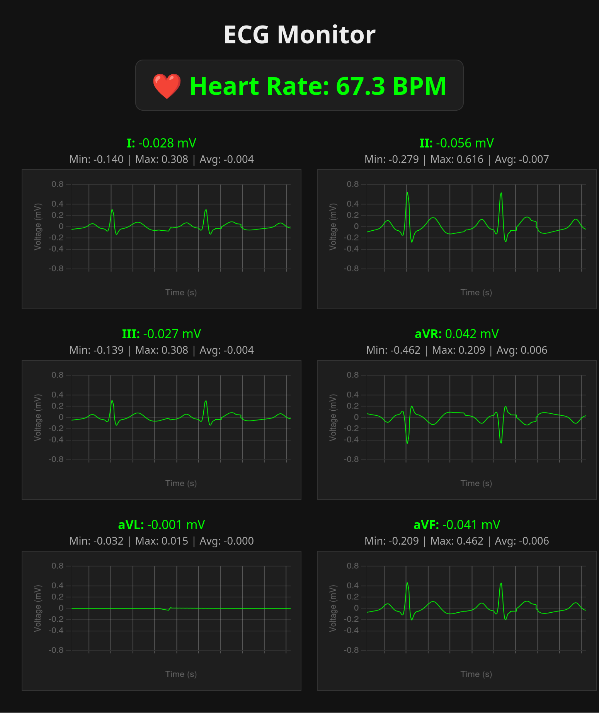

# 🫀 ECG Monitor

A modular, containerized system for real-time ECG signal simulation, processing, and visualization. This project includes:

- A **simulator** that generates realistic ECG signals and streams them over a virtual serial device
- A **signal processor** that filters the raw signals, removes noise, detects QRS complexes, and estimates BPM
- A **web-based app** to visualize raw and filtered signals across multiple leads in real-time
- A **persistence layer**  for on-disk storage of raw or filtered ECG signals and derived metrics using the high-performance Parquet columnar file format with versionable schema. This enables efficient archival, analysis, and offline re-processing.

---

## 📦 Components

| Module              | Description |
|---------------------|-------------|
| `ecg_simulator`     | Streams synthetic ECG signals via a virtual serial port using [NeuroKit2](https://neurokit2.readthedocs.io/) |
| `signal_processing` | Filters the incoming ECG signals and publishes raw + filtered values over a `Pub` socket |
| `app`               | Flask-based web GUI for live ECG visualization and BPM display |

---

## 🚀 Getting Started

### 1. Unpack the tarball

```bash
tar xzf ecg_project.tgz
cd ecg_project
```
### 2.Build and run the containers
``` bash
$ ./start_containers.sh --build # subsequent invocations can omit the --build argument
...
Starting ecg_simulator...
....
Starting signal_processing...
....
Starting app container...
...
🎉 All containers launched.
🌐 ECG GUI available at: http://localhost:5000
🛑 To stop all containers, run: ./stop_containers.sh

```

### 3. Point your browser to localhost:5000, *et voilà!* 

### 4. Stop the containers
``` bash
$ ./stop_containers.sh
🧹 Stopping ECG containers...
app
signal_processing
ecg_simulator
...
✅ All containers stopped and cleaned up.

```
---
## 📁 Project Layout
```
ecg_monitor/
├── app/                       # Flask-based web app for real-time visualization
│   ├── app.py                 # Main server that connects to the signal processor
|   ├── ecg_logger.py          # Writes raw (or filtered) ECG data to Parquet
|   ├── ecg_reader.py          # Relays filtered ECG data to the web frontend
|   ├── socket_stream.py       # Pub-Sub streamer for reader/logger modules
│   └── static/                # Front-end JS/CS implementation and Chart.js assets
|   └── templates/             # Front-end HTML 

│
├── ecg_simulator/            # Simulates ECG signals and streams to virtual serial device
│   ├── ecg_simulator.py
│   
│
├── signal_processing/        # Filters, detects HR, and publishes ECG data
│   ├── signal_processor.py   # Core pipeline.
│   ├── filter.py             # Bandpass and notch filtering logic, QRS detection
│
├── ecg_config/               # Shared config across modules
│   └── settings.py           # Paths, ports, and environment-based constants
│
├── ecg_database/             # Parquet-based persistent ECG session logs (mounted volume)
│
├── dev/                      # Symlink to virtual serial device (e.g. /dev/pts/5)
│   └── device                # Created by simulator, consumed by signal processor
│
├── start_containers.sh       # Build + launch all components in Docker
├── stop_containers.sh        # Cleanly stop and remove all containers
├── Dockerfile(s)             # One per module, for isolation and portability
└── README.md
```
---
## ❓ Design & Rationale / FAQ
##### Q: A hardware simulator was already provided. Why did you write a new one? 
##### A: Glad you asked! The original hardware simulator spat out values in the range [0,1]. Typical real-world amplitudes for the ECG R-wave peak is -1.0 to 1.5mV. I assumed the original data was normalized in some fashion or purpose, but without knowing exactly how I found it impossible to reverse-engineer much use out of it, the waveforms looked nothing like ECG readings, and so I decided to just craft my own simulator using NeuroKit2's ecg package, which allows you to randomize parameters and do a lot of other cool stuff.  


##### Q: You also built a new GUI. Did the original not work?
##### A: Nope. I preserved the basic architecture (Flask + Chart.js + SSE), but the original was missing some dependencies and the charts themselves never displayed anything,so I scrapped it and built a new one that displays waveforms scrolling across moving charts. It looks and feels the part.


##### Q: Did all this take a lot of time?
##### A: Yes!

##### Q: Did you have fun and learn a lot regardless?
##### A: Also Yes! I got a crash course in biometric DSP and debugging weird Docker issues.

##### Q: Okay, great! Give us the rundown on the basic architecture of your implementation:
##### A: Sure! The pipeline consists of 3 stages (in 3 Docker containers):
1. The pipeline starts at the ecg_simulator: This streams a synthetic 3-electrode ECG signal (RA, LA, LL) over a virtual serial port. It models realistic cardiac activity using NeuroKit2.

2. The signal processor module opens to the read-side of the virtual serial device for input and creates an NNG (next-generation Nanomessage) Pub-Sub socket for output. The pipeline within the signal_processing module proceed as follows:
    * collect the raw (RA,LA,LL) voltage triple from the serial device. samples are timestamped at moment of capture
    * raw samples are filtered out for power-line interference, DC offset, and EMG noise
    * The 6 derived leads are calculated from the filtered 3-electrode sample
    * Lead II is used to estimate HR in real-time using R-peak detection over a sliding window
    * The 6 derived leads + BPM + timestamp, and the 3 raw ecg reads + timstamp, are each serialized into a msgpack binary and sent over the Pub-Sub socket on the 'filtered' and 'raw' topics resp.
3. The Flask app subscribes to the Pub-Sub network, consuming filtered data for display on the GUI, and a separate thread logs the raw-topic data to the ecg_database/ mount.

##### Q: Why do run the logger/db thread from the GUI vs its own process or service?
##### A: Because for the purpose of this exercise, each launch of the pipeline represents a new "patient" or "test subject" and a new "session", and this is how we partition the parquet files for persistent storage.

##### Q. Tell us more about this persistence layer in your design
##### A. ECG signals are high-frequency, structured and append-only, perfect for a columnar storage format like Apache Parquet. From these files, we can, for example,query them locally with DuckDB without spinning up a DBMS, use them as the starting point for other ETL pipelines (data lakes for large-scale analytics, ML pipelines, etc), use them for replay to test different signal processing pipelines..the possibilities are endless.

##### Q. What about testing?
##### A. A lot of testing and iteration went into the design of this solution (see the error handling logic for sockets and devices), but I didn't have the time to write a full unit-testing suite. Comprehensive unit and integration tests are imperative in real-world projects, however for this project involving mostly data streaming and transformation, it would involve a lot of mocking up and I simply ran out of time.